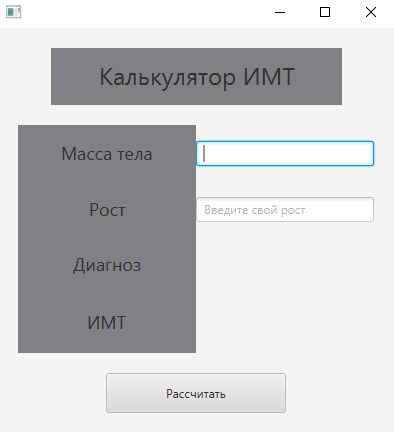

# BMI calculator
**Описание:** В данном репозитории представлен **Калькулятор BMI**, для рассчета индекса массы тела.
Расчёт индекса массы тела определяется на основе массы человека и его роста.

**Скриншот рабочего окна приложения:**

## Архитектура
**Скриншот диаграммы классов:**

## Зависимости
Язык программироваия **Java**, комплект разработчика приложений **JDK 19**, а так же **JavaFX**.
## Конфигурация
Для данного ПО не требуется специальная настройка
## Применение
Для использования калькулятора BMI вам необходимо:
* Ввести массу и рост человека;
* Нажать на кнопку *Рассчитать*;

После нажатия на кнопку вам будет выведен индекс тела.

